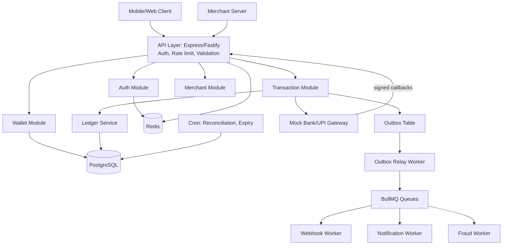

# PayFlow: Digital Wallet & Payments Backend
*A PhonePe/Paytm-style system built with Node.js, TypeScript and PostgreSQL. Design doc, features and 1-month roadmap.*

> **Scope note:** This is a **simulation**. It uses a mock bank/UPI gateway and never handles real card data or real money. Real payments need licensed gateways (Razorpay, Stripe) and PCI-DSS compliance. Say this in your README.

---

## 1. Goals

- Money is never created, lost or double-spent, even under concurrency, retries and crashes.
- Every rupee movement is traceable through an append-only ledger.
- Async work (webhooks, notifications) is reliable and survives failures.
- Easy to explain in an interview.

---

## 2. Features

### MVP (must build)
| Module | Features |
|---|---|
| **Auth** | Register/login, argon2 password hashing, JWT access + refresh tokens, logout and token revocation |
| **Wallet** | Auto-created wallet, balance, KYC-lite status (mock), wallet limits |
| **Transaction PIN** | 4-6 digit PIN (hashed), lockout after 3 wrong attempts |
| **Add money** | Top-up via mock gateway with pending/success/failed states |
| **P2P transfer** | Send by phone number or UPI-style ID (`name@payflow`), atomic and idempotent |
| **History** | Paginated, filterable statement (date, type, status), downloadable CSV |
| **Merchant payments** | Merchant registration, API keys, payment requests, signed webhooks |
| **Refunds** | Full and partial refunds as reversing ledger entries |

### Advanced (pick 2-3 if time allows)
- Payment requests ("collect money") between users
- QR code payments (merchant static and dynamic QR)
- Scheduled/recurring payments
- Rule-based fraud flags (velocity, amount spikes, new device)
- Cashback/rewards engine
- Split bills
- Admin API: freeze wallet, view audit logs, manual reversal with approval
- Daily reconciliation report

---

## 3. Architecture

**Style:** a modular monolith (one deployable API) plus separate worker processes. This is easier to build and debug than microservices, and you can explain how modules would split later.



### Layers inside each module
`Route -> Controller -> Service -> Repository -> DB`
- **Controller:** parse and validate input (Zod), return responses
- **Service:** business rules, transactions
- **Repository:** SQL only

### Tech choices
| Concern | Choice | Reason |
|---|---|---|
| Database | PostgreSQL | ACID, row locks, constraints |
| Cache/limits | Redis | Rate limiting, idempotency fast path, token blacklist |
| Queue | BullMQ | Retries, backoff, delayed jobs, dead-letter |
| Validation | Zod | Runtime + static types |
| DB access | `pg` or Prisma (raw SQL for locking queries) | Control over `FOR UPDATE` |
| Testing | Jest + Supertest, k6 | Integration, concurrency, load |
| Infra | Docker Compose, GitHub Actions | Reproducible dev and CI |

---

## 4. Data Model

```
users(id, name, phone UNIQUE, email UNIQUE, password_hash, pin_hash,
      pin_attempts, status, created_at)

wallets(id, user_id UNIQUE, currency, balance BIGINT CHECK(balance >= 0),
        daily_limit, status, version, updated_at)

transactions(id, type[TOPUP|TRANSFER|MERCHANT_PAY|REFUND|REVERSAL],
             status[INITIATED|PENDING|SUCCESS|FAILED|REVERSED],
             amount BIGINT CHECK(amount > 0), from_wallet_id, to_wallet_id,
             idempotency_key, request_hash, parent_txn_id, failure_reason,
             created_at)
   UNIQUE(user_id, idempotency_key)

ledger_entries(id, transaction_id, wallet_id, direction[DEBIT|CREDIT],
               amount BIGINT, balance_after BIGINT, created_at)
   -- append-only; entries per transaction sum to zero

merchants(id, user_id, business_name, api_key_hash, webhook_url,
          webhook_secret, status)

payment_requests(id, merchant_id, amount, order_ref, status, expires_at)

gateway_events(id, provider_event_id UNIQUE, payload, processed_at)

outbox(id, aggregate_id, event_type, payload, status, attempts,
       next_retry_at, created_at)

audit_logs(id, actor_id, action, entity, entity_id, metadata, ip, created_at)
```

**Rules:**
- Money is stored in **paise as integers**, never floats.
- Ledger rows are never updated or deleted. Corrections are new reversing entries.
- `wallets.balance` is a cached value. The ledger is the source of truth.

**Key indexes:**
- `ledger_entries(wallet_id, created_at DESC)` for statements
- `transactions(from_wallet_id, created_at DESC)` and `(to_wallet_id, created_at DESC)`
- `transactions(user_id, idempotency_key)` unique
- `outbox(status, next_retry_at)` for the relay poller

---

## 5. Core Flows

### 5.1 P2P transfer (the heart of the system)
1. Client sends `POST /transfers` with `Idempotency-Key`, receiver, amount and PIN.
2. Check the idempotency store. If the key exists with the same body hash, return the saved response. If the body differs, return `422`.
3. Verify PIN and check rate limit and daily limit.
4. `BEGIN`.
5. Lock both wallets: `SELECT ... FROM wallets WHERE id IN ($1,$2) ORDER BY id FOR UPDATE` (consistent order prevents deadlocks).
6. Validate: active wallets, not self-transfer, sufficient balance.
7. Insert `transactions` row, then a DEBIT and a CREDIT ledger entry. Update both balances.
8. Insert an `outbox` event (`TRANSFER_SUCCESS`) in the same transaction.
9. `COMMIT`. Save the idempotent response.
10. The outbox relay publishes to the queue. Notification and webhook workers run.

If the server crashes before `COMMIT`, nothing happened. After `COMMIT`, the outbox guarantees the event is eventually delivered.

### 5.2 Add money (top-up via mock gateway)
1. Create transaction `INITIATED`, call the mock gateway, mark `PENDING`.
2. The gateway calls back with an HMAC-signed webhook after a delay.
3. Verify the signature and timestamp (rejects replays), then insert `gateway_events` using the unique provider event ID (rejects duplicates).
4. In one DB transaction: move the state `PENDING -> SUCCESS`, write ledger entries (system pool wallet debited, user credited), update balance.
5. Late or out-of-order callbacks are ignored by the state machine.

### 5.3 Merchant payment
1. The merchant server calls `POST /merchant/payment-requests` with its API key and gets a payment link or QR.
2. The customer authorizes with their PIN, and the wallet transfer runs as in 5.1.
3. A signed webhook goes to the merchant (`payment.success`) with retries: 1m, 5m, 30m, 2h, then dead-letter.
4. The merchant can call `POST /merchant/refunds`, which creates a reversing transaction linked by `parent_txn_id`.

### 5.4 State machine
```
INITIATED -> PENDING -> SUCCESS -> REVERSED
                     \-> FAILED
```
A single transition map enforces this. Illegal moves throw.

---

## 6. API Surface (v1)

| Area | Endpoints |
|---|---|
| Auth | `POST /auth/register`, `/auth/login`, `/auth/refresh`, `/auth/logout`, `POST /auth/pin` |
| Wallet | `GET /wallet`, `GET /wallet/statement?from&to&type&cursor` |
| Top-up | `POST /topups`, `GET /topups/:id`, `POST /gateway/callback` |
| Transfer | `POST /transfers`, `GET /transactions/:id`, `POST /payment-requests`, `POST /payment-requests/:id/pay` |
| Merchant | `POST /merchants`, `POST /merchant/payment-requests`, `POST /merchant/refunds`, `GET /merchant/settlements` |
| Admin | `POST /admin/wallets/:id/freeze`, `GET /admin/audit-logs`, `GET /admin/reconciliation` |
| Ops | `GET /health`, `GET /metrics` |

Use **cursor pagination** for statements, a consistent error format (`{code, message, details}`), and Swagger/OpenAPI docs.

---

## 7. Security

- argon2 for passwords and PIN. PIN lockout with Redis counters.
- Short-lived access tokens (15 min), rotating refresh tokens stored hashed.
- Rate limiting per IP and per user (sliding window in Redis), stricter on login, PIN and transfer routes.
- Merchant API keys stored hashed and shown once. Webhooks signed with HMAC-SHA256.
- Input validation on every route. Parameterized queries only.
- Never log PINs, tokens or full phone numbers. Mask sensitive fields.
- Audit log for every money-affecting and admin action.
- Helmet, CORS allowlist, secrets via environment variables.

---

## 8. Reliability and Correctness

| Risk | Defense |
|---|---|
| Double-spend under concurrency | Row locks with `FOR UPDATE`, `CHECK (balance >= 0)` |
| Deadlocks | Always lock wallets in ascending ID order |
| Retry creates duplicate transfer | Idempotency keys with request hash |
| Crash after commit, event lost | Transactional outbox and relay worker |
| Duplicate/replayed gateway callbacks | Unique provider event ID, timestamp check, state machine |
| Silent balance drift | Nightly reconciliation: `SUM(ledger)` vs `wallets.balance`, alert on mismatch |
| Webhook endpoint down | Exponential backoff, dead-letter queue, manual replay |
| Stuck PENDING transactions | Expiry cron that queries the gateway and resolves or fails them |

---

## 9. Folder Structure

```
src/
  app.ts, server.ts
  config/            env, logger
  shared/            errors, middleware, db, redis, utils
  modules/
    auth/            routes, controller, service, repo, schema
    wallet/
    transaction/     transfer.service.ts, state-machine.ts
    ledger/
    topup/
    merchant/
    webhook/
    admin/
  workers/           outbox-relay.ts, webhook.worker.ts, notify.worker.ts
  jobs/              reconciliation.ts, expire-pending.ts
migrations/
tests/               unit, integration, concurrency, load (k6)
docs/                architecture.md, decisions.md, api.yaml
docker-compose.yml, Dockerfile, .github/workflows/ci.yml
```

---

## 10. One-Month Roadmap

### Week 1: Foundation
- **D1** Setup: TypeScript, lint/format, Docker Compose (Postgres, Redis), folder structure
- **D2** Migrations and core tables with constraints
- **D3-4** Auth: register/login, JWT, refresh rotation, Zod, error handler
- **D5** Wallet creation, balance, statement endpoint with cursor pagination
- **D6** Transaction PIN and lockout
- **D7** Tests and README draft
- **Milestone:** signup, login, wallet, PIN

### Week 2: Ledger, Transfers, Concurrency
- **D8-9** Double-entry ledger and balance recompute function
- **D10-11** Atomic transfer with locking, validations, limits
- **D12** Idempotency (Redis fast path plus DB unique constraint)
- **D13** Concurrency tests: 100 parallel debits never overdraw, 50 same-key requests move money once
- **D14** Refactor and commit
- **Milestone:** safe money movement

### Week 3: Gateway and Async Reliability
- **D15-16** Mock gateway module and top-up flow
- **D17-18** Signed webhooks: HMAC, timestamp check, dedupe table
- **D19** Central state machine
- **D20-21** Outbox table, relay worker, BullMQ with retries and dead-letter queue
- **Milestone:** top-ups and callbacks work, no lost events after a crash

### Week 4: Merchants, Hardening, Ship
- **D22-23** Merchant onboarding, API keys, payment requests, merchant webhooks, refunds
- **D24** Rate limiting, daily limits, fraud rule, audit logs
- **D25** Reconciliation and pending-expiry jobs
- **D26** k6 load test, indexes, `EXPLAIN ANALYZE`, record numbers
- **D27** GitHub Actions CI, deploy (Render/Railway + Neon + Upstash)
- **D28-30** Swagger docs, architecture and ER diagrams, demo video, interview notes
- **Milestone:** deployed, documented, benchmarked

**If you fall behind:** cut QR, scheduled payments, fraud rules and admin API first. Never cut tests, idempotency, locking or the ledger.

---

## 11. Testing Strategy

- **Unit:** state machine, limit checks, HMAC verification
- **Integration:** every endpoint against a real Postgres (Testcontainers or Docker Compose)
- **Concurrency:** parallel transfers, same-key retries, opposing transfers A->B and B->A (deadlock check)
- **Failure injection:** throw an error mid-transaction and assert zero partial writes
- **Invariant check after every test run:** total ledger sum is zero and each wallet balance equals its ledger sum
- **Load:** k6 on transfers and statements. Report p95 latency, TPS and zero mismatches.

---

## 12. Scaling Story (for interviews)

- Read replicas for statements and analytics
- Partition `ledger_entries` by month
- Move workers and the gateway module to separate services
- Shard wallets by user ID, with care for cross-shard transfers (saga or two-phase approach)
- Kafka instead of BullMQ at high volume
- Separate analytics store (ClickHouse) for reports

---

## 13. Interview Cheat Sheet

1. Why a ledger instead of updating balances directly
2. How lock ordering prevents deadlocks
3. Isolation levels (Read Committed vs Repeatable Read vs Serializable) and what you used
4. How idempotency works and where the key is stored
5. What the outbox pattern solves that "publish after commit" doesn't
6. How you detect and handle balance mismatches
7. What changes when the system grows 100x

---

## 14. Definition of Done

- [ ] All MVP features working and tested
- [ ] Concurrency tests passing in CI
- [ ] Reconciliation shows zero drift after load test
- [ ] Deployed with a live link and Swagger docs
- [ ] README with architecture diagram, ER diagram, benchmark numbers and the simulation disclaimer
- [ ] 2-minute demo video
- [ ] `docs/decisions.md` explaining each major design choice
